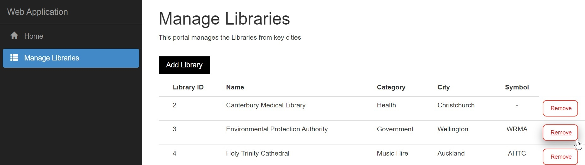
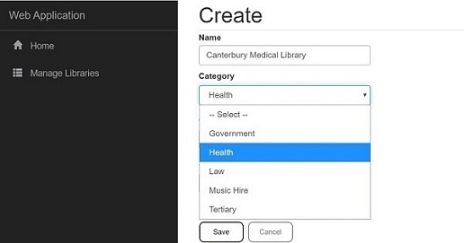

# ManageLibraries

This single-page application (SPA) was built to manage libraries with:
- [React](https://reactjs.org/) for client-side code
- [C#](https://docs.microsoft.com/en-us/dotnet/csharp/programming-guide/) and [ASP.NET](https://dotnet.microsoft.com/apps/aspnet) for cross-platform server-side code
- [SQL Server](https://www.microsoft.com/en-us/sql-server/)
- [Bootstrap](https://getbootstrap.com/) as the CSS framework for layout and stylin

# Additional Information
Here is the screen for adding a new library:

## References
C# Corner article[^1]
[^1]: [C# Corner](https://www.c-sharpcorner.com/)

